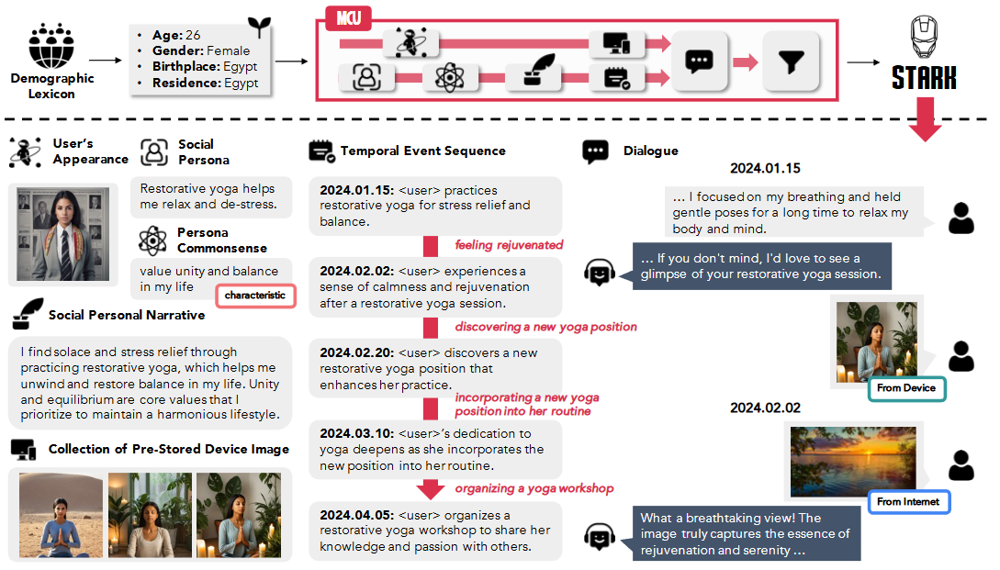

# Stark: Social Long-Term Multi-Modal Conversation with Persona Commonsense Knowledge

[🏠 Homepage](https://stark-dataset.github.io/) | [📄 Arxiv](https://arxiv.org/abs/2407.03958) | [📕 PDF](https://arxiv.org/pdf/2407.03958)

## List of Provided Model Series
- **Ultron-Summarizer-Series:** [🤖 Ultron-Summarizer-1B](https://huggingface.co/passing2961/Ultron-Summarizer-1B) | [🤖 Ultron-Summarizer-3B](https://huggingface.co/passing2961/Ultron-Summarizer-3B) | [🤖 Ultron-Summarizer-8B](https://huggingface.co/passing2961/Ultron-Summarizer-8B)
- **Ultron-11B**: [🤖 Ultron-11B](https://huggingface.co/passing2961/Ultron-11B)

> 🚨 Disclaimer: All models and datasets are intended for research purposes only.

## 📰 News
- Stark dataset has been released in 🤗 [Huggingface Datasets](https://huggingface.co/collections/passing2961/stark-6729a40126cec81fa24cd09d).
- Ultron-11B has been released in 🤗 [Huggingface Models](https://huggingface.co/collections/passing2961/thanos-6711f7a74227c6088d5d88f8).
- The code for fine-tuning and MCU pipeline will be released soon! Stay tuned!

## Stark Dataset

**Stark** is a publicly available, large-scale, long-term multi-modal conversation dataset that encompasses a diverse range of social personas, multi-modality formats, time intervals, and images. To automatically construct Stark, we introduce a novel multi-modal contextualization framework, **MCU**, which generates long-term multi-modal dialogues distilled from ChatGPT and our proposed **Plan-and-Execute Image Aligner**. An overview of MCU and an example from Stark are illustrated below.



The **Stark** dataset contains many images that originate from different sources, including a personalized text-to-image generator (i.e., [PhotoMaker](https://photo-maker.github.io/)), [Bing Search](https://pypi.org/project/icrawler/), and Image DB retrieval, thanks to our proposed **Plan-and-Execute** Image Aligner to ensure the high quality of the Stark dataset. Therefore, we divide the entire collection of images into two repositories based on the source:

1. **[stark-image](https://huggingface.co/datasets/passing2961/stark-image)**: Contains images from the personalized text-to-image generator, Bing Search, and Image DB retrieval (excluding [CC12M](https://github.com/google-research-datasets/conceptual-12m) and [RedCaps12M](https://redcaps.xyz/)). 
2. **[stark-image-url](https://huggingface.co/datasets/passing2961/stark-image-url)**: Contains images sourced from CC12M and RedCaps12M, which provide the image URL links. 

For Image DB retrieval, we use CLIP (i.e., `ViT-L/14@336px`) to retrieve images from prepared source image datasets: [CC12M](https://github.com/google-research-datasets/conceptual-12m), [RedCaps12M](https://redcaps.xyz/), [ChartQA](https://github.com/vis-nlp/ChartQA), [AI2D](https://arxiv.org/pdf/1603.07396v1), and [MathVision](https://huggingface.co/datasets/MathLLMs/MathVision). For efficient searching, we utilize [AutoFaiss](https://github.com/criteo/autofaiss).

**Note:** 
- In [stark-dialogue](https://huggingface.co/datasets/passing2961/stark-dialogue), we provide a text-only Stark dialogue dataset that contains only image keys that are stored in `"session<session_num>:images_key"` and `"session<session_num>:device_images_key"`. In these fields, if an image key is in the second repository (CC12M and RedCaps12M), it is prefixed with `"url:"`. Therefore, prepend `"url:"` to the `key` values from the [stark-image-url](https://huggingface.co/datasets/passing2961/stark-image-url) dataset as needed. In the `human_face_image_key` field, face image keys are prefixed with `"face:"`, so prepend `"face:"` to the `key` values in the [stark-human-face](https://huggingface.co/datasets/passing2961/stark-face-image) dataset as required.
- We initially stated in the paper that the dataset contained 93K episodic conversations; however, prior to public release, we manually removed specific samples, reducing the total to 86.9K episodes. Although this differs from the original number, Stark still features a comparable data scale (0.5M sessions) to SODA (1M) and Conversation Chronicles (1M) and is the first dataset to accomplish long-term multi-modal conversation at scale.

```python
from datasets import load_dataset

ds = load_dataset("passing2961/stark-dialogue")
```


## Ultron: Visual Imagination-Infused Large Language and Vision Model

### How to use

```python
import logging
from PIL import Image
import torch
from transformers import (
    AutoModelForVision2Seq,
    BitsAndBytesConfig,
    AutoProcessor,
)

# Define Ultron template
ULTRON_TEMPLATE = 'You are an excellent image sharing system that generates <RET> token with the following image description. The image description must be provided with the following format: <RET> <h> image description </h>. The following conversation is between {name} and AI assistant on {date}. The given image is {name}\'s appearance.\n{dialogue}'

# Ultron model initialization
def load_ultron_model(model_path):
    """
    Loads the Ultron model and processor.

    Args:
        model_path (str): Path to the pre-trained model.

    Returns:
        model: Loaded Vision-to-Seq model.
        processor: Corresponding processor for the model.
    """
    logging.info(f"Loading Ultron model from {model_path}...")
    quantization_config = BitsAndBytesConfig(
        load_in_4bit=True,
        bnb_4bit_compute_dtype=torch.bfloat16,
        bnb_4bit_use_double_quant=True,
        bnb_4bit_quant_type='nf4'
    )
    model_kwargs = dict(
        torch_dtype=torch.bfloat16,
        low_cpu_mem_usage=True,
        trust_remote_code=True,
        device_map="auto",
    )
    processor = AutoProcessor.from_pretrained(
        'meta-llama/Llama-3.2-11B-Vision-Instruct', torch_dtype=torch.bfloat16
    )
    model = AutoModelForVision2Seq.from_pretrained(
        model_path, 
        **model_kwargs
    ).eval()
    logging.info("Ultron model loaded successfully.")
    return model, processor

# Run Ultron model
def run_ultron_model(model, processor, dialogue, name='Tom', date='2023.04.20', face_image_path='sample_face.png'):
    """
    Runs the Ultron model with a given dialogue, name, and image.

    Args:
        model: Pre-trained model instance.
        processor: Processor for model input.
        dialogue (str): Input dialogue for the assistant.
        name (str): Name of the user.
        date (str): Date of the conversation.
        face_image_path (str): Path to the face image file.

    Returns:
        str: Description of the shared image.
    """
    logging.info("Running Ultron model...")
    face_image = Image.open(face_image_path).convert("RGB")

    prompt = ULTRON_TEMPLATE.format(
        dialogue=dialogue,
        name=name,
        date=date
    )
    messages = [
        {
            "content": [
                {"text": prompt, "type": "text"},
                {"type": "image"}
            ], 
            "role": "user"
        },
    ]

    logging.info("Preparing input for Ultron model...")
    prompt_input = processor.apply_chat_template(messages, add_generation_prompt=True)
    inputs = processor(face_image, prompt_input, return_tensors='pt').to('cuda')

    with torch.inference_mode():
        logging.info("Generating output from Ultron model...")
        output = model.generate(
            **inputs, 
            do_sample=True,
            temperature=0.9,
            max_new_tokens=512,
            top_p=1.0,
            use_cache=True,
            num_beams=1,
        )
    
    output_text = processor.decode(output[0], skip_special_token=True)
    logging.info("Output generated successfully from Ultron model.")
    return parse_ultron_output(output_text)

# Parse Ultron output
def parse_ultron_output(output):
    """
    Parses the output to extract the image description.

    Args:
        output (str): The generated output text from the model.

    Returns:
        str: Extracted image description.
    """
    logging.info("Parsing output from Ultron model...")
    if '<RET>' in output:
        return output.split('<h>')[-1].split('</h>')[0].strip()
    else:
        logging.warning("<RET> not found in output.")
        return output

# Example usage
def main():
    """
    Example usage of Ultron model.
    """
    model_path = "passing2961/Ultron-11B"
    model, processor = load_ultron_model(model_path)

    dialogue = """Tom: I have so much work at the office, I'm exhausted...
    Personal AI Assistant: How can I help you feel less tired?
    Tom: Hmm.. I miss my dog Star at home.
    Personal AI Assistant: """
    
    image_description = run_ultron_model(model, processor, dialogue)
    logging.info(f"Image description generated: {image_description}")

if __name__ == "__main__":
    main()
```

## License and Recommendations

🚨 All models and datasets are intended for research purposes only.

## Acknowledgement

This work was supported by a grant of the KAIST-KT joint research project through AI Tech Lab, Institute of convergence Technology, funded by KT [Project No. G01230605, Development of Task-oriented Persona-based Dialogue Generation Combining Multi-modal Interaction and Knowledge Modeling].

## Citation

If you find the resources in this repository useful, please cite our work:

```
@article{lee2024stark,
  title={Stark: Social Long-Term Multi-Modal Conversation with Persona Commonsense Knowledge},
  author={Lee, Young-Jun and Lee, Dokyong and Youn, Junyoung and Oh, Kyeongjin and Ko, Byungsoo and Hyeon, Jonghwan and Choi, Ho-Jin},
  journal={arXiv preprint arXiv:2407.03958},
  year={2024}
}
```
